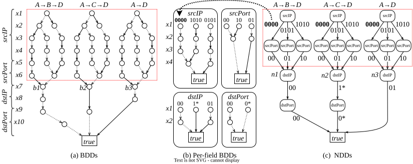

## About

**Network Decision Diagram (NDD)** is a new decision diagram data structure based on the classical Binary Decision Diagram (BDD).
In BDD, each node looks at a single **bit**, and branches based on whether the bit is true or false;
while in NDD, each node looks at a **field** consisting of a fixed number of bits, and branches based on the value of the corresponding field.
Since there can be more than 2 branches, NDD encodes the branching condition with external data structures.
NDD edges can use several label backends: the default standard BDD backend, a complemented-edge BDD backend (BCDD), or a finite-domain ZDD backend.
The low-level NDD implementation selects these engines through a common factory-created label backend interface, so core NDD operations call one label API instead of depending on a concrete BDD/ZDD/BCDD engine.
In this sense, NDD can be seen as wrapping a lower-level decision diagram with an outer field-aware layer, and therefore the name of NDD can also be interpreted as "Nested Decision Diagram".

## Branches

* Main: Featuring an efficient design of node table.
* Reuse: Featuring the reuse of label decision-diagram variables among all fields.
* Original: The original prototype for NSDI '25 paper.

## Benchmark

Run time (`second`) on different sizes of **NQueens** problem.

|  N | BDD (JDD) | NDD-Original  | NDD    |
| -- | --------- | ------------- | ------ |
| 10 |    0.5479 |        0.7315 | 0.2136 |
| 11 |    2.7947 |        2.7497 | 0.7619 |
| 12 |   19.0108 |       10.2289 | 3.4391 |
| 13 |  148.9701 |       66.7104 |23.6618 |

Detailed benchmark results are available on [nqueensBenchmarkDDs](https://github.com/XJTU-NetVerify/nqueensBenchmarkDDs)

Recent N-Queens label-backend comparison at `N=12`:

| target | time (s) | memory (MB) | 
| --- | ---: | ---: |
| ndd-bdd | 3.0199 | 567.2 | 
| ndd-zdd | 2.8683 | 559.4 | 
| ndd-bcdd | 3.0480 | 742.1 | 

Full backend comparison results are in [`results/nqueens_backend_results.md`](results/nqueens_backend_results.md) and the wiki.

## The Origin of NDD

NDD was originally proposed for network verification, where each NDD node represents a packet header field (destination IP address)
We observed NDD was more efficient than BDD in terms of memory and computation.
The reason is due to the **locality** of field-based matching semantics, NDD can significantly reduce the number of label decision-diagram nodes for each field.
The figure below shows an example, where the three BDDs in (a) can be represented by three equivalent NDDs in (c), 
where each edge of which is labelled by per-field BDDs in (b).



## Resources

- [wiki](https://github.com/XJTU-NetVerify/NDD/wiki)
- [NSDI Paper](https://www.usenix.org/system/files/nsdi25-li-zechun.pdf)
- [NSDI talk slides](https://xjtu-netverify.github.io/papers/NDD/NDD-A-Decision-Diagram-for-Network-Verification.pdf)
- [NSDI talk video](https://www.youtube.com/watch?v=9Ni6Z7qKGV4)

## Bibtex

```bibtex
@inproceedings{NDD,
  title={NDD: A Decision Diagram for Network Verification},
  author={Li, Zechun and Zhang, Peng and Zhang, Yichi and Yang, Hongkun},
  booktitle={22nd USENIX Symposium on Networked Systems Design and Implementation (NSDI 25)},
  pages={237--258},
  year={2025}
}
```

### Contact

- Zechun Li (1467874668@qq.com)
- Peng Zhang (p-zhang@xjtu.edu.cn)
- Yichi Zhang (augists@outlook.com)
- Hongkun Yang (hkyang@google.com)

## License

Apache-2.0. See [`LICENSE`](LICENSE).
