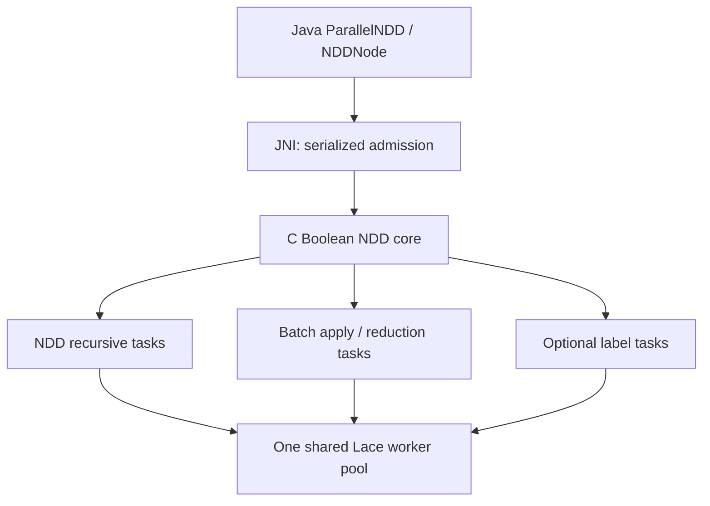

# Parallel NDD

The `parallel` branch provides a **C11 core + JNI + Java instance API** for parallel
Boolean Network Decision Diagrams. It supports BDD, BCDD, ZDD, BITSET and mixed
fields, while retaining the existing Java implementation as a baseline.

Six workers achieve **3.52–3.56× native scaling on N-Queens** and about
**1.69–2.03× on the larger SRE network-verification workloads**. On SRE
fattree12/MF3, six workers are **2.26–3.13× faster than the corresponding
original Java implementation** for the measured A/B/D profiles. Small SRE
loads do not amortize worker startup and synchronization.

- [Native build, API and configuration reference](native/README.md)
- [Implementation report (中文)](doc/parallel-implementation.md)
- [Current core experiments and N-Queens samples (中文)](results/ndd_parallel_core_20261012/README.md)
- [SRE A/B/D: all 27 workloads, memory, phases and reproduction (中文)](results/sre_mixed_parallel_20261013/README.md)
- [SRE cross-list batching and original Java controls (中文)](results/sre_priority_batch_20261012/README.md)
- [Archived five-round N-Queens Java/native comparison](results/parallel_ndd_20261011_aligned_final/README.md)
- [Correctness and sanitizer validation](results/parallel_ndd_20261011_aligned_validation/README.md)

## Current performance

Measurements use an i7-14700KF Linux/WSL host, six physical cores selected by
CPU affinity `0,2,4,6,8,10`, GCC 13.3 Release and Java 17. The tables below show
arithmetic means of **two independent processes per configuration**. Native
self-scaling is `T_native(1) / T_native(6)`; the Java comparison includes the C
implementation, caches, allocation, existing batch integration and thread gains.
It does not isolate the effect of adding threads.

### N-Queens: native computation

2026-10-12 cohort: original Boolean encoding, fixed left-fold, BCDD, cache
262144, 3 GiB native
diagram budget, label tasks disabled. C computation excludes initialization and
close; these seconds cannot be compared directly with SRE application totals.

| N | 1 worker s | 6 workers s | Native self-scaling | Solutions |
|---:|---:|---:|---:|---:|
| 12 | 3.445 | 0.978 | **3.52×** | 14,200 |
| 13 | 25.337 | 7.113 | **3.56×** | 73,712 |

Each solver enters one external Lace RUN; recursive NDD work supplies the
parallelism. These runs had no NDD or label GC. Exact samples, build hashes and
settings are in [the current-core N-Queens data](results/ndd_parallel_core_20261012/nqueens/summary.json).
The broader BDD/BCDD/ZDD, Java JNI, BITSET/compact and 1–28 worker experiments
remain in the explicitly archived measurements below.

### SRE: Java versus native 1/6 workers

2026-10-13 cohort: A = Header-BDD / Link-BDD, B = Header-BDD / Link-ZDD,
D = Header-BCDD /
Link-ZDD. The matrix covers fattree04/08/12 and MF=1/2/3: **162 fresh processes**,
all successful. Within each profile, route counts, field layout, link ordering
and polarity, condition digests, full RIB text/counts and reachability CSV
matched. RIB and reachability outputs also matched across A/B/D.

The table highlights MF3; [all 27 workloads](results/sre_mixed_parallel_20261013/matrix/tables.md)
include MF1/2 and slower cases. Time is the application's `total`, including
initialization, SRC, RIB output and data-plane analysis, excluding JVM startup,
post-timing checks and native close.

| Profile / fattree / MF | Original Java s | Native1 s | Native6 s | Native self-scaling | Java/native6 |
|---|---:|---:|---:|---:|---:|
| A / 08 / 3 | 9.199 | 8.495 | 5.591 | 1.52× | 1.65× |
| B / 08 / 3 | 8.893 | 7.844 | 5.195 | 1.51× | 1.71× |
| D / 08 / 3 | 9.260 | 7.738 | 5.206 | 1.49× | 1.78× |
| A / 12 / 3 | 385.119 | 288.472 | 170.449 | **1.69×** | **2.26×** |
| B / 12 / 3 | 185.754 | 125.705 | 62.140 | **2.02×** | **2.99×** |
| D / 12 / 3 | 200.338 | 129.093 | 63.938 | **2.02×** | **3.13×** |

B/D give similar native performance on the large case. Two samples and runs
blocked by profile/size do not establish a stable advantage for either Header
backend. A has 101 NDD collections per run versus four for B/D, and slower
data-plane phases; GC wall time was not separately measured. All six-worker
large-case totals beat Java, but individual phases can regress: A's forwarding
and reachability remain slower than Java. The SRC stage itself scales by
2.34–2.38×; the complete application scales less.

| fattree12 / MF3 | Java peak RSS MiB | Native1 peak RSS MiB | Native6 peak RSS MiB |
|---|---:|---:|---:|
| A | 6497.6 | 3915.6 | 3951.7 |
| B | 4848.2 | 3163.0 | 3395.5 |
| D | 5489.3 | 3698.9 | 3369.4 |

RSS is the mean of two **whole-process high-water marks**, including Java,
Sylvan, Lace and allocator overhead. Some smaller inputs use more native RSS.
The common process RSS guard is 12 GiB; JVM heap is 8 GiB and native diagram
budget is 3 GiB. Native caches for 04/08/12 are 262144/4194304/16777216 entries,
with the same settings for all profiles and worker counts at each size.

Header-Link order, original trim and plan=1 are preserved. Native NDD/batch
parallelism is enabled, label tasks disabled, threshold/chunk/depth=4/2/4,
priority-list block=64 and adapter GC water mark explicitly 1228 MiB. The
adapter's default remains 35% of its graph budget; this benchmark setting was
not selected separately for each profile. Java retains its frozen original
compute path, with post-timing compatibility/checksum fixes recorded in the
[report](results/sre_mixed_parallel_20261013/README.md).

Java JDD and Sylvan ZDD have different internal variable directions. Their
physical field/link mapping and failure semantics match, but cross-Java ratios
include representation differences. Native1/6 hold the representation fixed.
The ZDD digest is a diagnostic, can degenerate for dense families, and is used
alongside explicit small-domain tests, full RIB/counts and reachability outputs.

MF1 shows little native scaling; 04 six-worker runs are usually slower.
04/MF2/3 have zero BGP routes under the original trim and mainly measure setup
and small checks. There is no universal speedup claim.

### SRE F profile and optimization history

The latest generic-core F (BCDD/BCDD) cohort held SRE classes, input, JNI calling
pattern, cache and GC settings fixed while tuning versioned cache publication
and Lace coordinator locality:

| F profile / MF3 | Previous native1 s | Previous native6 s | Current native1 s | Current native6 s | Current self-scaling |
|---|---:|---:|---:|---:|---:|
| fattree08 | 7.823 | 6.133 | 7.628 | 4.950 | 1.54× |
| fattree12 | 125.120 | 68.871 | 125.345 | 61.862 | 2.03× |

Java was not rerun in this cohort, so no Java ratio is inferred from its
historical timings. The [core report](results/ndd_parallel_core_20261012/README.md)
contains controls, phases, RSS and artifact hashes. Coordinator polling can
increase idle CPU consumption.

Earlier [cross-list batching measurements](results/sre_priority_batch_20261012/README.md)
recorded F/12/MF3 Java/native1/native6 of 323.948/121.398/68.434 s (1.77× native
scaling, 4.73× versus Java). These use the preceding build and are not mixed
with the current cohort. The initial scalar integration had no parallel gains;
[its complete report](results/sre_parallel_20261011_final/README.md) and the
[profiling analysis](results/sre_parallel_analysis_20261012/README.md) preserve
that result. Task organization, core storage/cache changes and resource policy
matter as well as worker count.

### Published data and reproduction

Reports include raw timing/metric records, logs, checks, build settings and source
snapshots. Compiled `.so`/JAR files and class directories remain in local artifact
archives; their exact hashes are recorded in manifests. Commands referring to
frozen artifact directories require those archives. A fresh checkout can build
the current core using the commands below; SRE also requires the matching SRE
adapter and Java-control versions recorded in its report/source snapshots.

## What is parallelized?

NDD branches on a **field**, with symbolic sets of field values as edge labels.
The native engine primarily parallelizes recursive **NDD operations**, adds
explicit **batch parallelism**, and optionally parallelizes label operations.
All three layers share one Lace worker pool.


```mermaid
flowchart TD
    J[Java ParallelNDD / NDDNode] --> I[JNI: serialized admission]
    I --> C[C Boolean NDD core]
    C --> N[NDD recursive tasks]
    C --> B[Batch apply / reduction tasks]
    C --> L[Optional label tasks]
    N --> P[One shared Lace worker pool]
    B --> P
    L --> P
```

- **NDD operations:** AND filters empty label intersections and splits surviving
  child problems into chunks. OR/DIFF generate local child results and merge
  coverage/residuals in the parent. EXIST processes child subgraphs and combines
  them in a deterministic order. Small problems run directly.
- **Batch operations:** `applyBatch` submits independent applications together;
  AND/OR reductions support a fixed left-fold or balanced tree. Each batch enters
  one top-level Lace `RUN`, using `CALL`/`SPAWN` internally. `prioritySelect`
  prepares ordered group coverage and selects independent conditions together,
  preserving group priority and optional multipath semantics.
- **Label operations:** BDD, BCDD and ZDD have optional recursive task splitting.
  BITSET uses direct word operations. Label spawning is disabled by default:
  N-Queens benefited chiefly from the NDD layer.
- **Storage and synchronization:** nodes have sorted, contiguous edges; canonical
  tables grow on demand under shard locks. Cache keys include operation/context.
  Locks occupy separate 64-byte cache lines, and worker-local statistics and ID
  leases reduce shared updates. Cache-line isolation substantially improved scaling.

The engine reuses Lace scheduling and Sylvan BCDD/ZDD storage, GC and reference
infrastructure, and draws on MTPNDD's task partitioning/reference handoff design.
Checked label adapters propagate table exhaustion as errors. Dependency changes
are confined to a build-local copy; versions and licenses are in [NOTICE](native/NOTICE).

## Backends and supported operations

| Backend | Label representation | Field width |
|---|---|---:|
| BDD | Plain C BDD, without complemented edges | 1–4096 bits |
| BCDD | Sylvan complemented-edge BDD | 1–4096 bits |
| ZDD | Ordinary set-family ZDD with explicit powerset universe | 1–4096 bits |
| BITSET | Two 64-bit words | 1–7 bits |

Each width-`w` field has a Boolean domain of `2^w` values. Fields can mix backends;
variables are shared and right-aligned within each backend. Field and bit indices
start at zero, with bit 0 most significant.

The new API supports constants, literals, exact field values, AND/OR/NOT/DIFF,
XOR/IMP/EQUIV/NAND/NOR, EXIST, `satCount`, evaluation, batch apply and AND/OR
reduction. `satCount` returns `double`, matching the legacy counting semantics.
Multi-terminal arithmetic and a complete migration of the legacy manipulation API
remain future work. N-Queens tests Boolean behavior, not multi-terminal algebra.

## Build and verify

Linux prerequisites: a C11 compiler, CMake 3.23+, Python 3, Git, pthreads, a JDK
and Maven. Initial configuration fetches pinned Sylvan and Lace sources.

```sh
export JAVA_HOME=/path/to/jdk
cmake -S native -B native/build-release -DCMAKE_BUILD_TYPE=Release
cmake --build native/build-release -j
ctest --test-dir native/build-release --output-on-failure
mvn -Dpndd.tests=true -Dpndd.library="$PWD/native/build-release/libpnddjni.so" package
```

The legacy Java artifact can still be built with `mvn package` without a native
build. Existing pinned local dependency checkouts and sanitizer commands are
covered in [native/README.md](native/README.md).

The archived initial validation passed Release/Debug CTest at 1/2/4/6 workers,
29 Maven tests,
ASan/UBSan with leak detection at 1/6 workers, and `-Xcheck:jni`. Small-domain
enumeration covers all four backends and mixed fields, including GC, stale handles,
resource exhaustion and recovery. All 410 final cold-process benchmark samples
matched known solution counts; 20 warm entry samples are reported separately.

## Use the Java API

```java
import org.ants.jndd.parallel.*;

public class ParallelExample {
    public static void main(String[] args) {
        try (ParallelNDD engine = new ParallelNDD(new ParallelNDDConfig(6),
                 new ParallelNDD.Field(32, ParallelNDD.Backend.BCDD),
                 new ParallelNDD.Field(7, ParallelNDD.Backend.BITSET));
             NDDNode prefix = engine.literal(0, 0, true);
             NDDNode port = engine.value(1, 42);
             NDDNode allowed = engine.and(prefix, port)) {
            System.out.println(engine.satCount(allowed)); // 2^31
        }
    }
}
```

Save as `ParallelExample.java`, then compile and run from the repository root:

```sh
javac -cp target/ndd-1.0.1-jar-with-dependencies.jar ParallelExample.java
java -Dpndd.library="$PWD/native/build-release/libpnddjni.so" \
  -cp .:target/ndd-1.0.1-jar-with-dependencies.jar ParallelExample
```

Operations borrow their inputs and return an owned root. Both `ParallelNDD` and
`NDDNode` implement `AutoCloseable`; use try-with-resources or explicitly close
owned results. Closing a node does not consume other nodes. Use `engine.retain(node)`
when another independently closeable reference is needed.

For batch work, `engine.applyBatch(operation, left, right)` returns an array of
owned results; close each element. `engine.reduce(AND|OR, LEFT_FOLD|BALANCED_TREE,
...)` returns one owned result. Balanced-tree order can greatly increase
intermediate graphs: it is an explicit choice, not the N-Queens default.

Default API configuration: NDD/batch spawning enabled, label spawning disabled,
threshold 4, chunk 2, spawn depth 4, cache 262,144 entries, GC interval 128 and a
512 MiB diagram budget. Set `new ParallelNDDConfig(workers, memoryBytes)` for a
larger budget; the full constructor exposes all task-layer switches and capacities.

## Run N-Queens

```sh
# C driver: original encoding, six workers, fixed left-fold, 3 GiB graph budget.
native/build-release/pndd_nqueens 13 BCDD 6 0 0 3072

# Java API: batch construction, the same original encoding and left-fold.
java -Xmx512m -Dpndd.library="$PWD/native/build-release/libpnddjni.so" \
  -cp target/ndd-1.0.1-jar-with-dependencies.jar \
  org.ants.jndd.parallel.ParallelNQueens 13 BCDD 6 true false 3072

# Compact row encoding lets BITSET participate at larger N; report separately.
native/build-release/pndd_nqueens 13 BITSET 6 1 0 3072
```

N=12 has **14,200** solutions; N=13 has **73,712**. Original encoding uses N
fields of N bits and therefore rejects BITSET for N>7. Compact encoding uses
`ceil(log2 N)` bits per row and constrains valid values; it is a different
benchmark track. The Java CLI currently uses original encoding.

## Archived N-Queens measurements (2026-10-11)

This earlier build predates the SRE migration, Java BCDD terminal-normalization
fix and current core tuning. It is preserved for its broader backend and JNI
coverage; its Java ratios are not measurements of the current build.

The archived matrix uses five independent processes per configuration, shuffled
interleaved rounds, CPU affinity 0,2,4,6,8,10 on the current Linux guest, GCC 13.3
Release and Java 17. Native diagram budget / legacy Java heap: 3 GiB; JNI JVM
heap: 512 MiB; common process-tree RSS ceiling: 4 GiB. CPU IDs represent distinct
cores reported by the guest, not a guarantee of physical host placement.
All rows below use original encoding, the same final left-fold and default task
parameters. Timings are medians. Native combined cache and legacy per-operation
caches have different layouts/capacities, recorded in metadata.

### C core scaling: computation time in seconds

| N | Backend | 1 worker | 2 workers | 4 workers | 6 workers | 1→6 speedup |
|---:|---|---:|---:|---:|---:|---:|
| 12 | BDD | 3.839 | 2.074 | 1.288 | 1.115 | 3.44× |
| 12 | BCDD | 3.799 | 2.041 | 1.253 | 1.104 | 3.44× |
| 12 | ZDD | 3.808 | 2.076 | 1.268 | 1.105 | 3.45× |
| 13 | BDD | 27.174 | 14.781 | 9.167 | 7.575 | 3.59× |
| 13 | BCDD | 26.689 | 14.613 | 9.182 | 7.561 | 3.53× |
| 13 | ZDD | 26.699 | 14.926 | 9.276 | 7.552 | 3.54× |

This isolates scaling within the archived native engine. In this cohort its
single-worker path was slower than the corresponding legacy Java baseline.

### Wider worker sweep: up to 28 workers

A separate [five-round experiment](results/parallel_ndd_20261011_wide_scaling/REPORT.md)
tests 1/6/8/10/12/14/16/20/24/28 workers with the same original encoding,
left-fold and capacity settings. Each speedup uses the same backend's one-worker
median **within this new cohort**. All 300 samples returned the correct counts.

| N | Highest compute speedup | Configuration | Highest C process speedup | Configuration |
|---:|---:|---|---:|---|
| 12 | 3.92× | ZDD, 28 workers | 3.71× | BDD, 16 workers |
| 13 | 4.01× | BCDD, 16 workers | 3.91× | BCDD, 16 workers |

Scaling approaches a plateau: N=13/BCDD reaches 3.98× with 8 workers and 4.01×
with 16 workers, a difference of less than 1%. Nearby configurations have
overlapping timing ranges. [Full curves and raw data](results/parallel_ndd_20261011_wide_scaling/REPORT.md)
include every backend/configuration and initialization/cleanup costs.

### Java API: end-to-end time and peak RSS

Native Java API rows use six workers and batch construction. Legacy Java rows
use the same label backend. Total times include JVM startup, initialization,
construction, combination, counting and cleanup, measured with an outer
**monotonic clock**.

| N | Backend | Legacy Java total s | Parallel Java API total s | Speedup | Legacy / parallel RSS MiB |
|---:|---|---:|---:|---:|---:|
| 12 | BDD | 3.242 | 1.328 | 2.44× | 474.6 / 217.0 |
| 12 | BCDD | 2.726 | 1.476 | 1.85× | 458.9 / 254.7 |
| 12 | ZDD | 3.237 | 1.476 | 2.19× | 475.7 / 247.1 |
| 13 | BDD | 20.346 | 8.204 | 2.48× | 2257.2 / 896.7 |
| 13 | BCDD | 19.017 | 8.235 | 2.31× | 2629.8 / 959.6 |
| 13 | ZDD | 19.878 | 8.385 | 2.37× | 2258.3 / 944.6 |

The product comparison includes representation, allocation, cache, JIT and GC
costs; it is distinct from native thread scaling. The complete final data is in
[samples.csv](results/parallel_ndd_20261011_aligned_final/samples.csv), with commands,
source/binary hashes, source snapshots and archived raw logs alongside it.

In a separate five-round paired N=12/BCDD/six-worker C-driver experiment, the new
core took **1.105 s / 184.6 MiB**, versus MTPNDD's **1.215 s / 1585.7 MiB**:
about 10% faster computation and 8.6× lower RSS. MTPNDD uses fixed tables and a
different initialization boundary; this is a driver/configuration comparison.
In its full matrix, all N=13 samples exceeded the common 4 GiB RSS ceiling.
See [paired data](results/parallel_ndd_20261011_aligned_mtp_pair/README.md) and the
[full report](doc/parallel-implementation.md) for limitations and failed experiments.

### Reproduce the experiments

```sh
python3 native/scripts/benchmark.py --suite final --repeats 5 --timeout 120 \
  --out results/my_parallel_run
python3 native/scripts/benchmark.py --suite smoke --out results/my_all_backend_run
python3 native/scripts/benchmark.py --suite compact --out results/my_compact_run
```

Check CPU topology and supply `--cores` for your machine. Use a fresh output
directory. The harness records failures, compiler versions, capacities, commits,
source snapshots, phase timings, RSS, node/cache/task/GC statistics and full
commands. Additional suites cover JNI scalar/batch, layer ablation, tuning and
MTPNDD; see the [benchmark reference](native/README.md#benchmarks).

## Lifecycle and current limits

- One native engine can be active per JVM/process. External calls serialize
  admission; operation-internal and explicit batch tasks execute in parallel.
- Prefer a worker count within the process's available CPUs. A build-local Lace
  adapter respects Linux affinity masks and adds short sleeps to GC synchronization
  waits when workers outnumber CPUs. CI also tests six workers on two CPUs.
- NDD mark/sweep runs **between operations** in a stopped Lace frame. Sylvan
  label GC can run **inside** label operations, with temporary roots and pending
  results protected. A single operation or batch must fit its graph budget.
- Budget/table exhaustion returns an error or Java `OutOfMemoryError`. Release
  unwanted roots, collect and retry; graph budget excludes JVM, Lace and allocator
  overhead, so it is not a process RSS limit.
- Native handles detect released and cross-engine nodes. The current global
  32-bit generation space eventually exhausts safely and requires process restart.
- Fields: at most 256. Counting uses `double`, with possible precision loss above
  `2^53` and overflow to infinity. Multi-terminal algebra and operation-internal
  NDD GC remain future work. Application gains still need network-verification
  workloads in addition to N-Queens.

## About NDD and the other branches

**Network Decision Diagram (NDD)** is a field-aware decision diagram originally
proposed for network verification. Each edge represents a symbolic subset of a
field's values, encoded with a label backend, instead of branching on one bit or
one concrete field value. NDD can also be understood as a **Nested Decision Diagram**.

- `parallel`: C core, JNI, Java instance API and shared-pool parallel operations.
- `main`: existing Java implementation and backend APIs.
- `Reuse`: label-variable reuse design.
- `Original`: prototype for the NSDI '25 paper.

The existing Java [API guide](https://github.com/XJTU-NetVerify/NDD/wiki/Manipulation-APIs)
and [usage guide](https://github.com/XJTU-NetVerify/NDD/wiki/Usage) remain available.
Historical library comparisons are in the
[N-Queens wiki](https://github.com/XJTU-NetVerify/NDD/wiki/Results-NQueens); those
measurements are separate from this branch's native matrix. Retired finite-domain
ZDD measurements are identified in [the archived backend report](results/nqueens_backend_results.md).

## Resources

- [wiki](https://github.com/XJTU-NetVerify/NDD/wiki)
- [NSDI Paper](https://www.usenix.org/system/files/nsdi25-li-zechun.pdf)
- [NSDI talk slides](https://xjtu-netverify.github.io/papers/NDD/NDD-A-Decision-Diagram-for-Network-Verification.pdf)
- [NSDI talk video](https://www.youtube.com/watch?v=9Ni6Z7qKGV4)

## Bibtex

```bibtex
@inproceedings{NDD,
  title={NDD: A Decision Diagram for Network Verification},
  author={Li, Zechun and Zhang, Peng and Zhang, Yichi and Yang, Hongkun},
  booktitle={22nd USENIX Symposium on Networked Systems Design and Implementation (NSDI 25)},
  pages={237--258},
  year={2025}
}
```

### Contact

- Peng Zhang (p-zhang@xjtu.edu.cn)
- Yichi Zhang (augists@outlook.com)
- Zechun Li (1467874668@qq.com)

## License

Apache-2.0. See [`LICENSE`](LICENSE).
