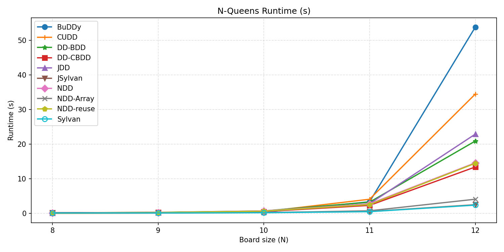
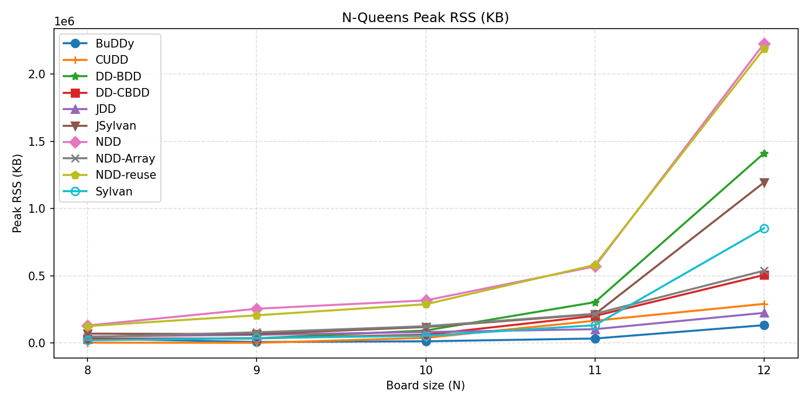
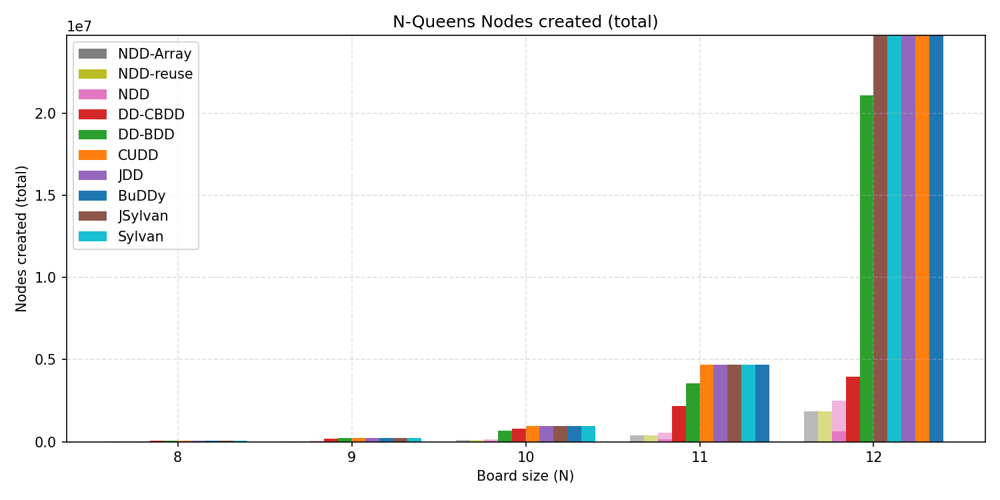
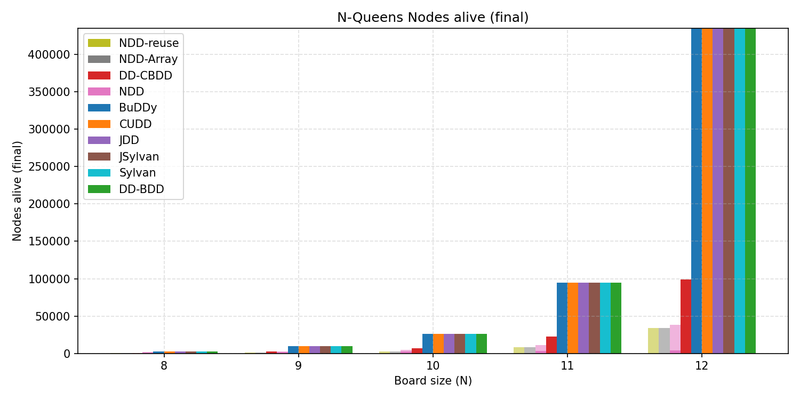

# NQueens Benchmark

This page shows a detailed NQueens benchmark [`results/nqueens_metrics.csv`](../results/nqueens_metrics.csv). 

## Libraries Included

- `BuDDy`
- `CUDD`
- `JDD`
- `Sylvan` (parallel, 48 cores)
- `JSylvan` (parallel, 48 cores)
- `DD-BDD`
- `DD-CBDD`
- `NDD`
- `NDD-reuse`
- `NDD-Array`

## Full Results Table

> Note: `Sylvan` and `JSylvan` are parallel BDD libraries and were run with 48 worker threads. All other implementations are single-threaded.

| Implementation | Lang | Size | Time (s) | Max RSS (KB) | Nodes Created | Nodes Alive | NDD Nodes Alive | BDD Nodes Alive | Solutions |
| --- | --- | ---: | ---: | ---: | ---: | ---: | ---: | ---: | ---: |
| BuDDy | C | 8 | 0.177728 | 32896 | 53611 | 2451 | 0 | 2451 | 92 |
| Sylvan | C | 8 | 0.129380 | 19360 | 54531 | 2451 | 0 | 2451 | 92 |
| CUDD | C | 8 | 0.030755 | 1784 | 52385 | 2451 | 0 | 2451 | 92 |
| JDD | Java | 8 | 0.155108 | 47172 | 53083 | 2451 | 0 | 2451 | 92 |
| JSylvan | Java | 8 | 0.213969 | 69064 | 54140 | 2451 | 0 | 2451 | 92 |
| NDD | Java | 8 | 0.091676 | 129764 | 18779 | 1593 | 415 | 1178 | 92 |
| NDD-reuse | Java | 8 | 0.091793 | 125192 | 10952 | 564 | 415 | 149 | 92 |
| NDD-Array | Java | 8 | 0.052788 | 44032 | 10797 | 600 | 415 | 185 | 92 |
| DD-BDD | C# | 8 | 0.161787 | 30028 | 52181 | 2458 | 0 | 2458 | 92 |
| DD-CBDD | C# | 8 | 0.152884 | 29800 | 46171 | 772 | 0 | 772 | 92 |
| BuDDy | C | 9 | 0.103554 | 6808 | 218386 | 9557 | 0 | 9557 | 352 |
| Sylvan | C | 9 | 0.140865 | 36444 | 219658 | 9557 | 0 | 9557 | 352 |
| CUDD | C | 9 | 0.103372 | 612 | 216602 | 9557 | 0 | 9557 | 352 |
| JDD | Java | 9 | 0.239033 | 60480 | 217230 | 9557 | 0 | 9557 | 352 |
| JSylvan | Java | 9 | 0.240352 | 65564 | 219050 | 9557 | 0 | 9557 | 352 |
| NDD | Java | 9 | 0.238483 | 254136 | 50676 | 2827 | 1133 | 1694 | 352 |
| NDD-reuse | Java | 9 | 0.237313 | 205412 | 29677 | 1323 | 1133 | 190 | 352 |
| NDD-Array | Java | 9 | 0.092256 | 78768 | 29451 | 1364 | 1133 | 231 | 352 |
| DD-BDD | C# | 9 | 0.304086 | 34384 | 215883 | 9565 | 0 | 9565 | 352 |
| DD-CBDD | C# | 9 | 0.284051 | 33888 | 185654 | 2795 | 0 | 2795 | 352 |
| BuDDy | C | 10 | 0.370187 | 12040 | 958740 | 25945 | 0 | 25945 | 724 |
| Sylvan | C | 10 | 0.201043 | 52788 | 959239 | 25945 | 0 | 25945 | 724 |
| CUDD | C | 10 | 0.510716 | 37752 | 954767 | 25945 | 0 | 25945 | 724 |
| JDD | Java | 10 | 0.548000 | 80832 | 956019 | 25945 | 0 | 25945 | 724 |
| JSylvan | Java | 10 | 0.276309 | 118408 | 958344 | 25945 | 0 | 25945 | 724 |
| NDD | Java | 10 | 0.731537 | 316372 | 146679 | 4967 | 2625 | 2342 | 724 |
| NDD-reuse | Java | 10 | 0.656860 | 287488 | 97922 | 2861 | 2625 | 236 | 724 |
| NDD-Array | Java | 10 | 0.213688 | 124168 | 97595 | 2905 | 2625 | 280 | 724 |
| DD-BDD | C# | 10 | 0.719891 | 92396 | 677687 | 25954 | 0 | 25954 | 724 |
| DD-CBDD | C# | 10 | 0.532938 | 61212 | 793143 | 6601 | 0 | 6601 | 724 |
| BuDDy | C | 11 | 3.359248 | 32756 | 4699647 | 94822 | 0 | 94822 | 2680 |
| Sylvan | C | 11 | 0.508812 | 131748 | 4694597 | 94822 | 0 | 94822 | 2680 |
| CUDD | C | 11 | 4.095165 | 165116 | 4687448 | 94822 | 0 | 94822 | 2680 |
| JDD | Java | 11 | 2.794735 | 102112 | 4691203 | 94822 | 0 | 94822 | 2680 |
| JSylvan | Java | 11 | 0.550157 | 213628 | 4693369 | 94822 | 0 | 94822 | 2680 |
| NDD | Java | 11 | 2.749738 | 568980 | 549688 | 11381 | 8244 | 3137 | 2680 |
| NDD-reuse | Java | 11 | 2.551880 | 580220 | 399087 | 8531 | 8244 | 287 | 2680 |
| NDD-Array | Java | 11 | 0.761938 | 216364 | 398650 | 8579 | 8244 | 335 | 2680 |
| DD-BDD | C# | 11 | 3.253436 | 303056 | 3568452 | 94832 | 0 | 94832 | 2680 |
| DD-CBDD | C# | 11 | 2.321530 | 200776 | 2170288 | 22455 | 0 | 22455 | 2680 |
| BuDDy | C | 12 | 53.763983 | 131932 | 24741296 | 435170 | 0 | 435170 | 14200 |
| Sylvan | C | 12 | 2.396625 | 853364 | 24703895 | 435170 | 0 | 435170 | 14200 |
| CUDD | C | 12 | 34.438353 | 290372 | 24740519 | 435170 | 0 | 435170 | 14200 |
| JDD | Java | 12 | 22.885259 | 223540 | 24719128 | 435170 | 0 | 435170 | 14200 |
| JSylvan | Java | 12 | 2.505391 | 1193636 | 24702044 | 435170 | 0 | 435170 | 14200 |
| NDD | Java | 12 | 14.604704 | 2226480 | 2481709 | 37931 | 33837 | 4094 | 14200 |
| NDD-reuse | Java | 12 | 14.471995 | 2188508 | 1860434 | 34180 | 33837 | 343 | 14200 |
| NDD-Array | Java | 12 | 4.100625 | 537192 | 1859828 | 34230 | 33837 | 393 | 14200 |
| DD-BDD | C# | 12 | 20.887879 | 1410584 | 21096247 | 435181 | 0 | 435181 | 14200 |
| DD-CBDD | C# | 12 | 13.407093 | 505408 | 3980309 | 98900 | 0 | 98900 | 14200 |

## Plots

### Time

### Memory

### Node Counts

